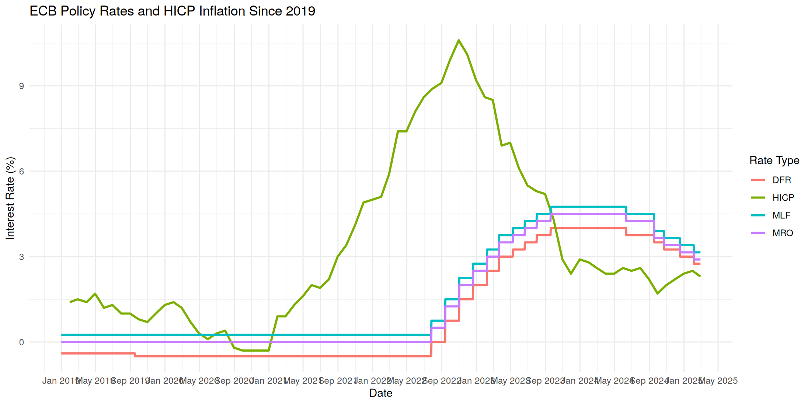
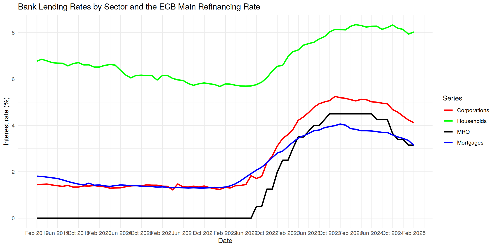
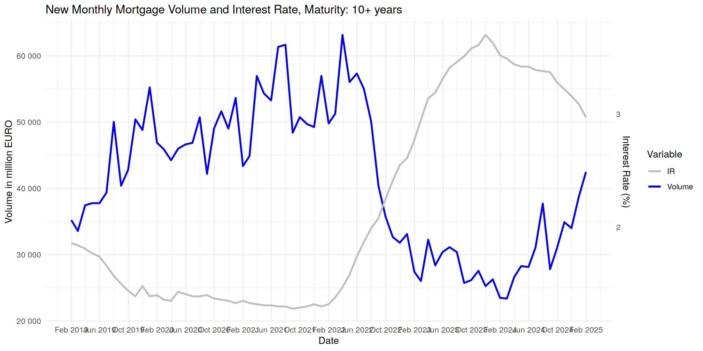
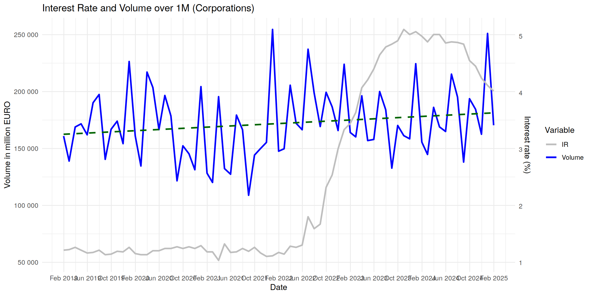

# ECB Rates and Bank Lending, 2019–2025

How euro area bank lending rates and volumes reacted to the ECB policy rate cycle, January
2019 – January 2025: mortgages by rate fixation period, consumer and revolving credit to
households, and loans to corporations by size. Monthly ECB statistics.

**Bottom line.** The 450 basis points of MRO hikes between July 2022 and September 2025 passed
through to lending rates unevenly. Rates on corporate loans rose by about three quarters of the
policy rate increase, mortgage rates by about half. Volumes reacted most where borrowers
commit for longest: new mortgages with rate fixation over 10 years fell by almost half from
2021 to 2025, while corporate and consumer lending volumes held broadly steady.

## Project overview

- **Question.** How quickly and how fully did the ECB's policy rate changes reach the rates
  banks charge households and firms, and how did new lending respond?
- **Scope.** Euro area aggregates, monthly, January 2019 – January 2025: 10 lending series
  (rate and volume for each), the three ECB policy rates and HICP inflation.
- **Pass-through by sector.** The rates of the different loan types are combined into one rate
  per sector, weighting each by its volume: households (consumer credit and revolving loans)
  and corporations (loans up to EUR 250k, EUR 250k–1M, over EUR 1M). Mortgages use the ECB's
  overall rate on new loans for house purchase.
- **Pass-through ratio.** Increase of a lending rate from June 2022, the last month before the
  first hike, to its peak, divided by the increase of the MRO over the same cycle (4.50
  percentage points).

## Data

All series are public and included in `data/`:

- **ECB Data Portal**: MFI interest rate statistics (new business rates and volumes by loan
  type, euro area), loans to households (outstanding amounts), HICP annual inflation, and the
  MRO and marginal lending facility rates (dates of change).
- **FRED**: the ECB Deposit Facility Rate (daily, series `ECBDFR`).

Volumes are in EUR millions, rates in % per year. Series are always aligned on the calendar
month, never by row position. Policy rates are published only when they change, so each rate
is carried forward until its next change.

## Results

**Lending rates by sector**, per cent:

| Series | Jan 2019 | Low | Peak | Jan 2025 | Pass-through |
|---|---|---|---|---|---|
| MRO | 0.00 | 0.00 | 4.50 (Sep 2025) | 3.15 | — |
| Corporations | 1.44 | 1.22 (Mar 2021) | 5.25 (Oct 2025) | 4.12 | 0.76 |
| Households, consumption | 6.77 | 5.68 (Dec 2021) | 8.35 (Feb 2024) | 8.03 | 0.59 |
| Mortgages | 1.81 | 1.30 (Jun 2021) | 4.06 (Nov 2025) | 3.14 | 0.48 |

- **Corporate rates move fastest and furthest.** Most corporate loans are at variable or short
  fixed rates, so their price follows money-market rates within months.
- **Mortgage rates move least.** Most euro area mortgages are fixed for long periods and are
  priced on long-term rates, which rose less than the policy rate.
- **Cuts are passed on in the same order.** From May 2024, the month before the first cut, to
  January 2025 the MRO fell by 1.35 percentage points, corporate rates by 0.90, mortgage rates
  by 0.62 and consumer credit rates by only 0.25.

**New lending volumes**, monthly average, EUR bn:

| Loan type | 2021 | 2025 | Change |
|---|---|---|---|
| Mortgages, all | 87.4 | 56.7 | −35% |
| Mortgages, fixation over 10 years | 52.6 | 28.1 | −47% |
| Mortgages, fixation 1–5 years | 6.9 | 6.6 | −4% |
| Consumer credit | 22.7 | 23.8 | +5% |
| Corporations, over EUR 1M | 155.2 | 172.2 | +11% |
| Corporations, up to EUR 250k | 33.7 | 40.2 | +19% |

- **Mortgages took the hit**, and mostly at long fixation periods: households stopped locking
  in long-term rates at cycle highs and shifted towards shorter fixations. New mortgage lending
  recovered in 2024 as rates started to fall.
- **Corporate and consumer lending held up.** Volumes stayed broadly stable despite rates above
  5%, consistent with loans needed for working capital and with firms rolling over existing
  credit.
- **The stock of household loans kept growing**, from EUR 5.7 trillion to 6.7 trillion, but
  flattened from late 2022.

## Code

The analysis is written in R:

| File | Content |
|---|---|
| `cs2_rates_and_lending.ipynb` | notebook with the full analysis step by step. It is saved already executed, so every table and all 12 charts can be read directly on GitHub |
| `cs2_rates_and_lending.R` | the same analysis as a single script, which saves the tables and charts to `output/` |

The data are included, so the analysis can be run as it is: `Rscript cs2_rates_and_lending.R`.
R packages: readr, dplyr, tidyr, purrr, lubridate, ggplot2, scales.

## Limitations

- **This is descriptive.** Rates and volumes are compared over time; nothing is estimated, and
  the co-movement of lending and policy rates is not a causal effect. Case Study 3 estimates the
  pass-through with panel regressions across countries.
- **Euro area aggregates hide national differences.** Pass-through to mortgages is much faster in
  countries where variable-rate mortgages dominate, such as Spain and Portugal, than in Germany
  or France.
- **Volumes depend on demand as well as supply.** A fall in new lending can reflect weaker
  demand from borrowers, tighter credit standards at banks, or both; these data cannot tell them
  apart.

## Conclusion

The ECB's tightening reached corporate borrowers quickly and almost fully, and mortgage
borrowers only partially, because of how their loans are priced. The adjustment in quantities
was concentrated in long-term fixed-rate mortgages, while lending to firms and consumer credit
remained broadly stable through the whole cycle.

## Credits

Group project for the Banking course of the MSc in Applied Data Science for Banking and Finance,
Università Cattolica del Sacro Cuore, with Arianna Pellizzari, Michele Fornari, Herman Myrlid
and Marco Macioni. This repository contains a cleaned-up and corrected version of the original
analysis.
